# LeWM Self-Driving

A self-driving world model trained on the [Comma2k19](https://huggingface.co/datasets/commaai/comma2k19) dataset, based on the [LeWorldModel](https://arxiv.org/abs/2603.19312) architecture (Maes et al., 2026).

The model learns to predict future latent states of a driving scene from raw camera pixels and vehicle actions, with no reconstruction loss and no pretrained encoder. It uses the SIGReg regulariser to prevent representation collapse, and an autoregressive causal Transformer predictor conditioned on actions via Adaptive Layer Normalization.

---

## Results

Training was run for 20 epochs on 4 chunks of Comma2k19 (789 segments) on an NVIDIA H100 80GB.  
The decoder was trained separately for 25 epochs as a visualisation tool only — it is not part of the JEPA training objective.

### Open-loop prediction (BM1)

The model predicts future latent states at 10x lower error than a null constant baseline across all horizons:

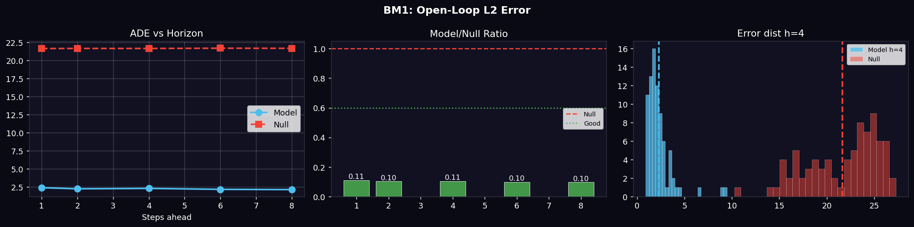

### Action sensitivity (BM2)

The latent space responds meaningfully to different action inputs. Acceleration vs braking produces the largest divergence (1.17), confirming the model is action-conditioned:

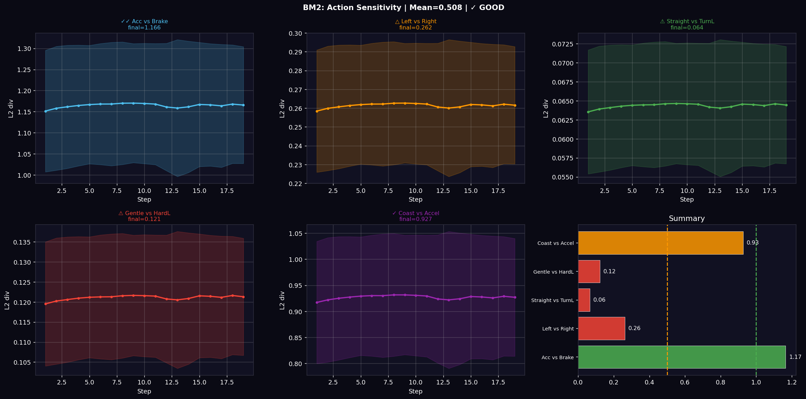

### CEM planner (BM3)

Cross-Entropy Method planning in latent space outperforms random action search (ratio 0.957, reach 45%):

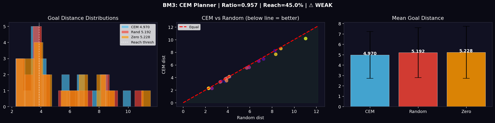

### Decoder reconstructions (BM4)

The decoder, trained on 25 epochs only, produces soft but structurally correct reconstructions. The encoder latent is already precise — the blurriness is a decoder capacity limitation, not a representation issue:

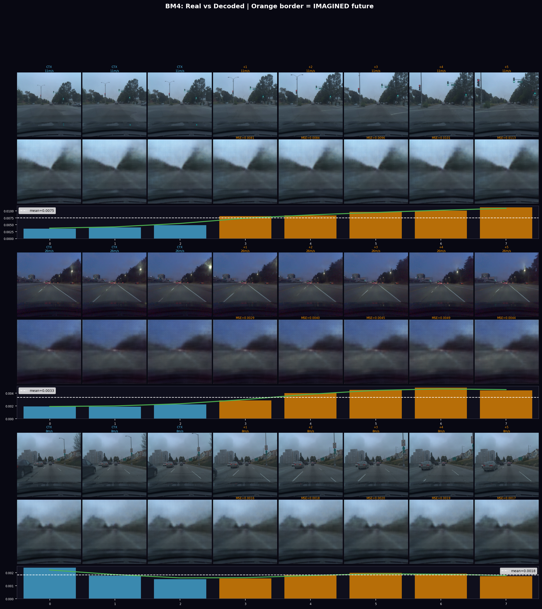

### Latent space structure (T2)

The 384-dimensional latent space organises cleanly by driving state. Speed and steering cluster visibly in t-SNE:

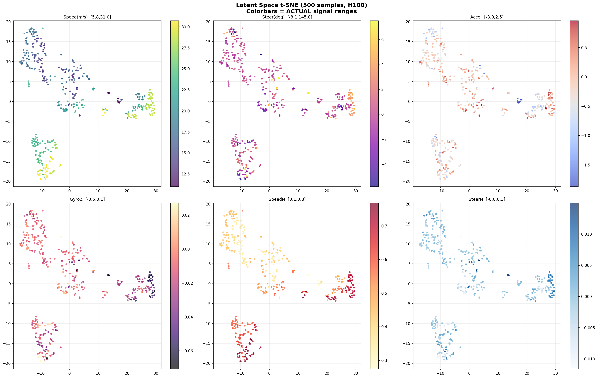

### Embedding health (T8)

0/384 dimensions collapsed. Distribution matches the SIGReg Gaussian target. Effective rank 34.9/384 at 20 epochs (increases with further training):

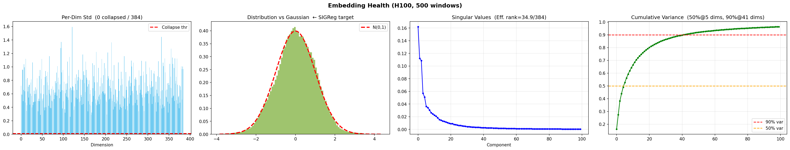

### Future selection accuracy (VL1)

Given context frames, the model correctly selects the true future sequence from 3 distractors 8/8 times (100%):

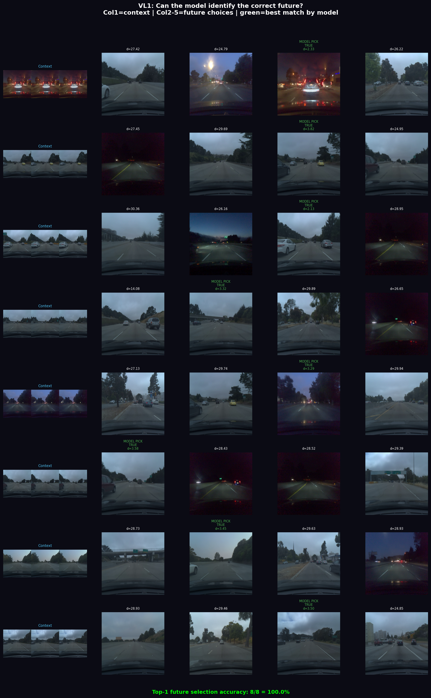

### Training curves (T0)

Prediction loss and SIGReg both converge smoothly. No instability:

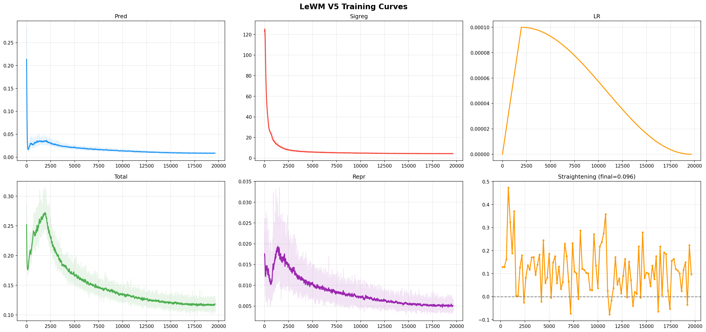

### Temporal straightening (T9)

Latent trajectories exhibit emergent temporal straightening (mean cosine sim 0.165) with no explicit regularisation:

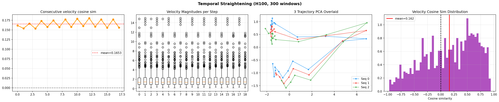

### CEM planning rollout (tA)

Action-conditioned imagination rollouts guided by CEM optimisation:

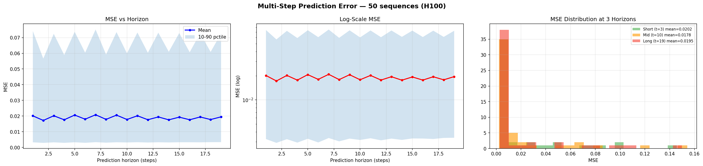

### Retrieval quality (tB)

Nearest-neighbour retrieval in latent space preserves driving-state semantics and improves over random retrieval on both speed and steering targets:

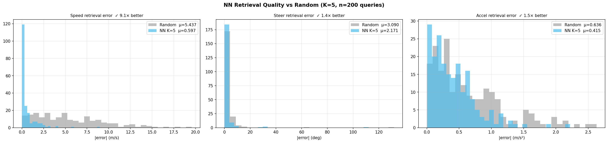

### Retrieval visuals (tB visual)

Qualitative retrieval panels show close structural matches in nearest latent neighbours with progressively harder negatives:

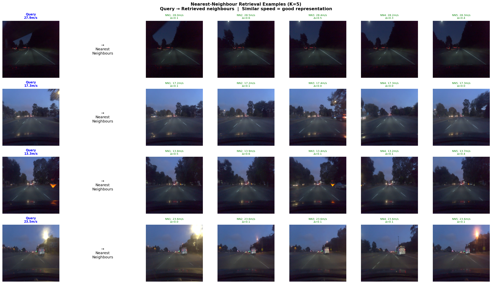

### Decoder latent interpolation (tdec1)

Linear interpolation between two latent states produces smooth decoded transitions, indicating manifold continuity:


### Decoder error heatmap (tdec2)

Per-pixel reconstruction error highlights that high-frequency textures dominate residual error while scene layout remains stable:


### Decoder temporal consistency (tdec3)

Decoded trajectories remain temporally coherent across short horizons, with smooth inter-frame change patterns:

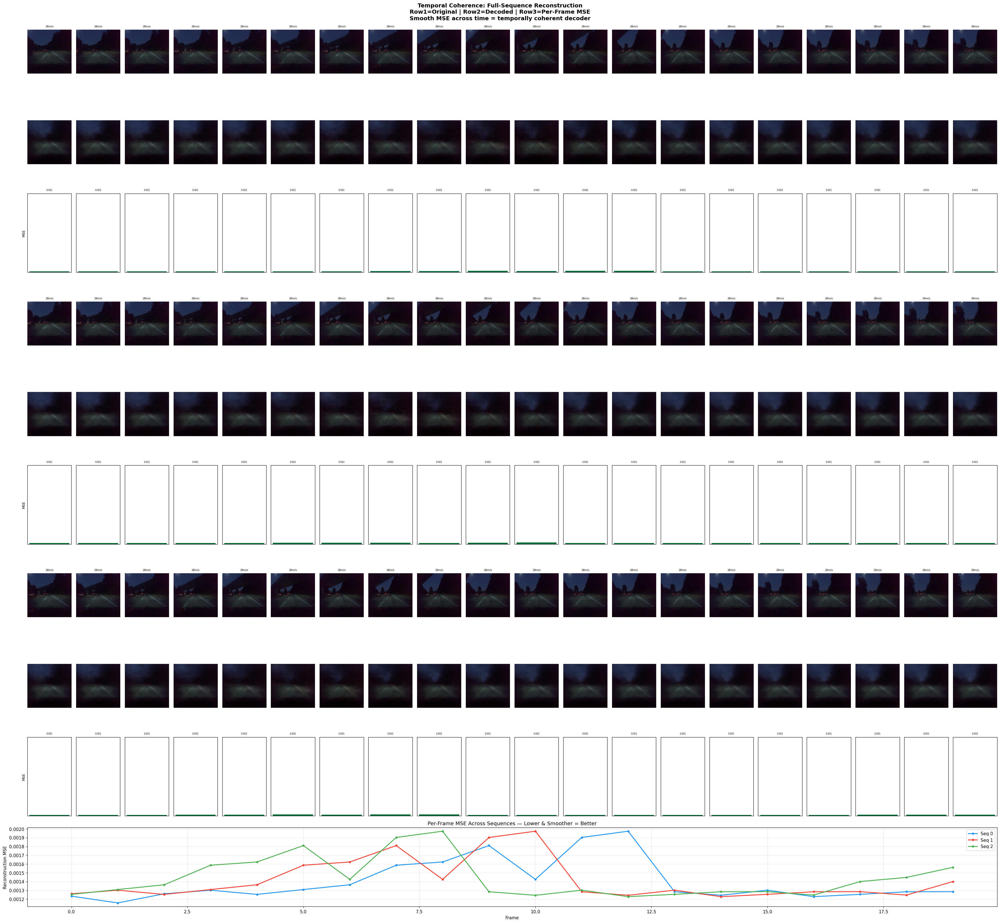

### Decoder dimension perturbation (tdec4)

Perturbing individual latent dimensions yields interpretable visual changes, supporting disentangled local control in latent space:


### Planning diagnostics (tsd1, tsd3, tsd4)

Additional diagnostics probe speed-memory structure, speed-latent alignment, and full latent planning storyboards:

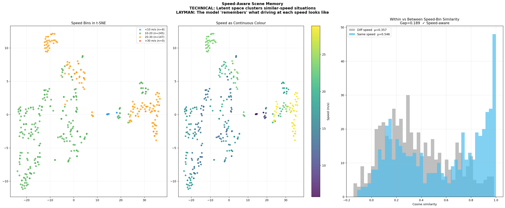

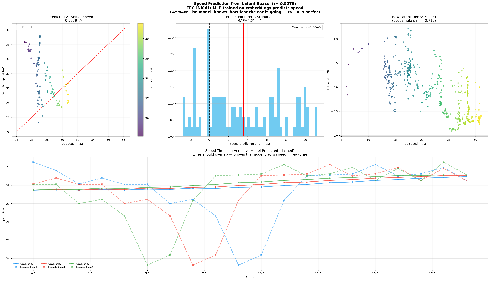

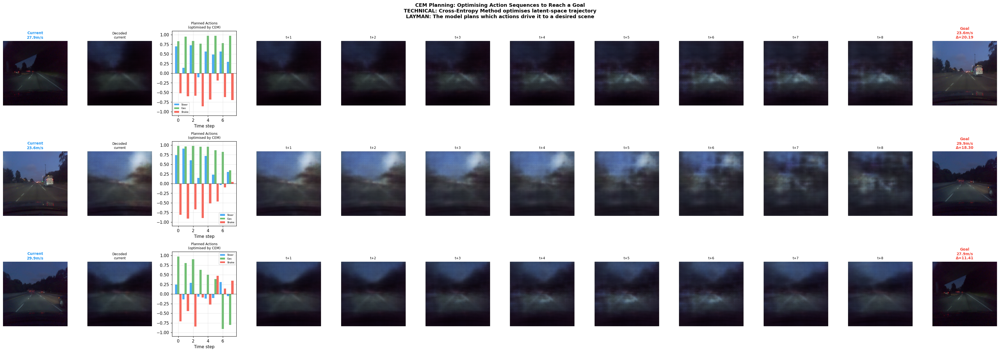

### Consolidated summary panel (tE)

A publication-style summary panel aggregates the final metrics, optimization trajectory, and stability indicators:

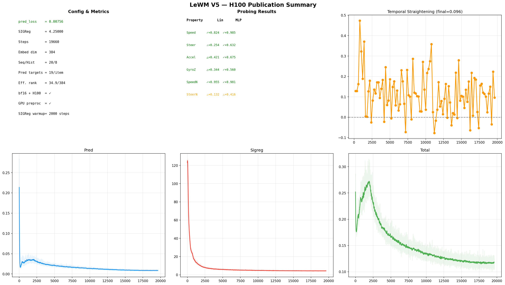

---

## Architecture

```
Encoder:   ViT (384-dim, 12 layers, patch=14)  ->  384-dim latent via CLS token + ProjMLP
Predictor: Causal Transformer (8 layers, 16 heads) with AdaLN action conditioning
Actions:   (steer, speed, brake) x frameskip=5, embedded via Conv1D + MLP
Loss:      MSE prediction  +  lambda * SIGReg  +  repr_cosine_smoothness

Parameters: 57.7M total
```

SIGReg (Balestriero & LeCun, 2025) prevents representation collapse by matching latent embeddings to an isotropic Gaussian via the Epps-Pulley test on random 1D projections, with a warmup schedule over 2000 steps.

---

## Quick start

### Install

```bash
pip install torch torchvision transformers einops matplotlib scipy scikit-learn av huggingface_hub
```

### Train

```bash
python train.py --lightning --chunks 1 2 3 4 --budget-hours 2.9
```

Or without Lightning.ai:

```bash
python train.py --data-dir ./comma2k19 --chunks 1 2 --budget-hours 3.0
```

Automatically selects the right batch size and precision for your GPU (H100, A100, or smaller).

### Evaluate

```bash
python tests.py --checkpoint ./checkpoints_v5/final.pt --lightning --output-dir ./results
```

Produces all benchmark and diagnostic plots in `./results/`.

---

## Hardware

Trained on NVIDIA H100 80GB HBM3 using bf16 mixed precision and torch.compile.  
The VRAM display in training logs shows allocated memory (~1.7 GB); total physical VRAM usage is ~84 GB due to reserved/cached buffers.

Minimum: 24 GB VRAM (reduce batch size and seq_len via `auto_configure`).

---

## Dataset

[Comma2k19](https://huggingface.co/datasets/commaai/comma2k19) — 33 hours of highway driving from a forward-facing camera, with CAN bus (speed, steering) and IMU (accelerometer, gyroscope) signals. The data pipeline includes GPU-accelerated HEVC decoding via NVDEC (ffmpeg hevc_cuvid), falling back to PyAV on CPU.

---

## Reference

```
@article{maes2026leworldmodel,
  title   = {LeWorldModel: Stable End-to-End Joint-Embedding Predictive Architecture from Pixels},
  author  = {Maes, Lucas and Le Lidec, Quentin and Scieur, Damien and LeCun, Yann and Balestriero, Randall},
  journal = {arXiv:2603.19312},
  year    = {2026}
}
```
